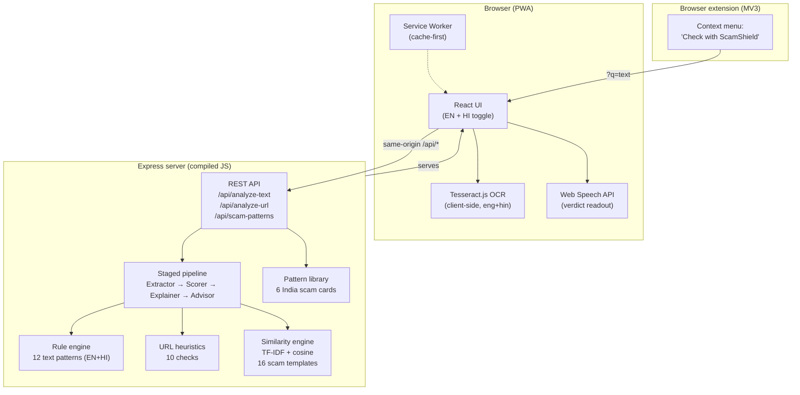

# ScamShield Architecture

## System overview



## Request flow — text analysis

```
POST /api/analyze-text { text, lang, debug? }
        │
        ▼
┌─────────────┐
│ 1. Extractor │  matchRules(text) → matched rule codes
│              │  extractUrls(text) → links found
├─────────────┤
│ 2. Scorer    │  score = Σ weights (cap 100)
│              │  risk = score≥60 dangerous · ≥30 suspicious · else safe
├─────────────┤
│ 3. Explainer │  localized red flags + plain-language explanation
├─────────────┤
│ 4. Advisor   │  recommended actions (incl. 1930 + cybercrime.gov.in)
│              │  similarKnownScams via TF-IDF + cosine vs 16 templates
└─────────────┘
        │
        ▼
{ score, riskLevel, redFlags, explanation, recommendedActions,
  similarKnownScams, engine: "rule-based", stages? (debug only) }
```

## URL check flow

```
POST /api/analyze-url { url, lang }
  → normalize → 10 heuristic checks (IP host, punycode, typosquat
    via Levenshtein vs known brands, shortener, suspicious TLD,
    brand embedding, @ trick, subdomains, login bait, no HTTPS)
  → { score, verdict, reasons[], engine: "rule-based" }
```

## Deployment

Single Render web service (free plan): the Express server serves the
compiled React bundle from `web/dist` and the API from the same origin —
no CORS tricks, no localhost fallbacks.

## Honesty notes

- Everything labeled `engine: "rule-based"` is deterministic heuristics,
  not a trained model. The README's AI Disclosure section lists exactly
  what is rules vs what could be LLM-backed later.
- OCR runs fully on-device via Tesseract.js; no image ever leaves the browser.
- The "similarity engine" is TF-IDF + cosine similarity, not an embedding model.
- The "staged agent pipeline" is a deterministic 4-stage pipeline, not an LLM agent.
